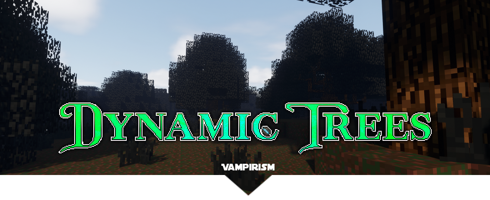

    

<h1 align="center">
Dynamic Trees for Vampirism
</h1>

    
    

 
Dynamic Trees compatibility add-on for Vampirism.

## Links
- [Downloads](https://www.curseforge.com/minecraft/mc-mods/dynamic-trees-vampirism/files)

## Trees
- Vampire Spruce
- Bloody Spruce

## Credits
### Development
View [this page](https://github.com/DynamicTreesTeam/DynamicTrees-Vampirism/graphs/contributors) for a list of people who have contributed code to this project.

### Translations
This project uses Dynamic Trees' translation spread sheet. See more info for those who maintain and have contributed [here](https://github.com/ferreusveritas/DynamicTrees/wiki/Translation-Credits). If you speak another language and would like to help, please ask in the [Dynamic Trees Discord](https://discord.gg/bGby2qxvqu).
